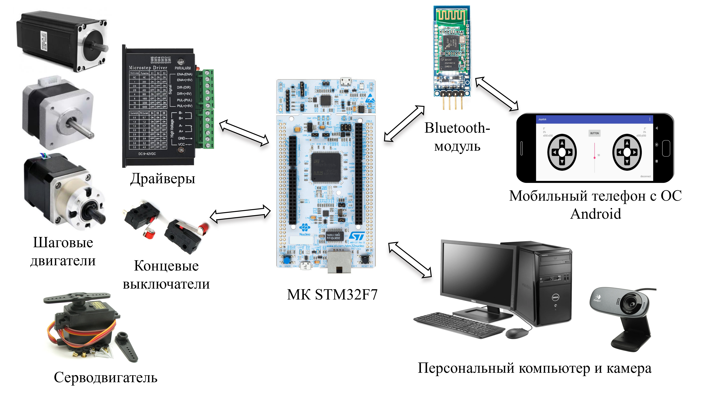
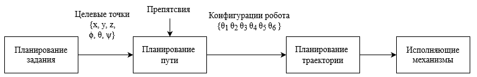
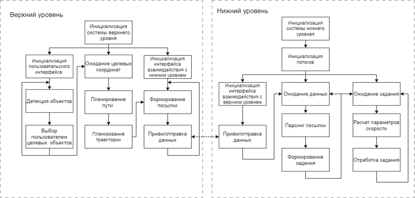

# diploma-experience

## Робот-манипулятор

Целью данной работы было разработать систему управления многозвенным роботом-манипулятором на базе микроконтроллера STM32F7 с использованием ChibiOS.

Основные задачи:
- сборка прототипа манипулятора;
- решение прямой и обратной задач кинематики;
- разработка структуры системы управления; 
- разработка пользовательского интерфейса;
- тестирование реализованной системы управления.

Основные технологии используемые в данной работе:
C/C++, Java и Android Studio, Python, OpenCV

Собранный прототип на основе модели https://github.com/4ndreas

### Основные компоненты исследуемого робота-манипулятора

Основными компонентами являлись:

### Ручное управление манипулятором

В представленных видео показано разработанное приложение на Java имитирующее управление джойстиком.
Приложение напрямую связывается с управляющим микроконтроллером по Bluetooth соединению. И позволяет управлять манипулятором в двух режимах.

Управление каждым из двигателей                                    Управление координатой хвата              

<table>
  <tr>
     <td></td>
    <td></td>
  </tr>
</table>

### Структура системы управления

Алгоритм работы программы:

### Результат работы

В представленных видео наглядно показана работа системы управления, которая позволяет передвигать целевые объекты, строя при этом траекторию с учетом препятствий и обладающая достаточной точностью для передвижения простых объектов.

Пользовательское приложение написанное на Python для детекции и выбора целевых шашек:

  

Построение одной башенки из выбранных пользователем шашек:                                    Сортировка шашек по цвету:             

<table>
  <tr>
     <td></td>
    <td></td>
  </tr>
</table>

