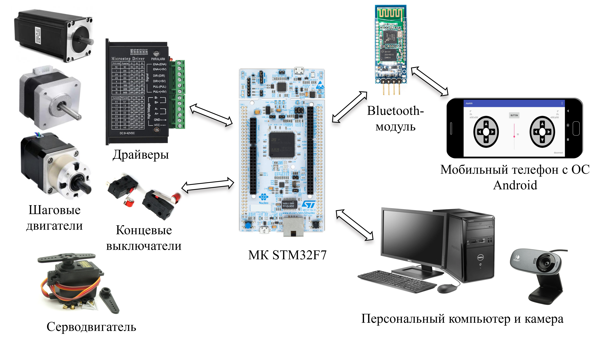

# diploma-experience

## Робот-манипулятор

Целью данной работы было разработать систему управления многозвенным роботом-манипулятором на базе микроконтроллера STM32F7 с использованием ChibiOS.

Основные задачи:
- сборка прототипа манипулятора;
- решение прямой и обратной задач кинематики;
- разработка структуры системы управления; 
- разработка пользовательского интерфейса;
- тестирование реализованной системы управления.

Основные технологии используемые в данной работе:
C/C++ и ChibiOS, Java и Android Studio, Python, OpenCV

Собранный прототип на основе модели https://github.com/4ndreas

### Основные компоненты исследуемого робота-манипулятора

### Ручное управление манипулятором

В представленных видео показано разработанное приложение на Java имитирующее управление джойстиком.
Приложение напрямую связывается с управляющим микроконтроллером по Bluetooth соединению. И позволяет управлять манипулятором в двух режимах.
           

<table>
  <tr>
    <td>
      <figure>
        <figcaption>Управление каждым из двигателей</figcaption>
        
      </figure>
    </td>
    <td>
      <figure>
        <figcaption>Управление координатой хвата</figcaption>
        
      </figure>
    </td>
  </tr>
</table>

### Структура системы управления

### Алгоритм работы программы

### Результат работы

В представленных видео наглядно показана работа системы управления, которая позволяет передвигать целевые объекты, строя при этом траекторию с учетом препятствий и обладающая достаточной точностью для передвижения простых объектов.

Пользовательское приложение написанное на Python для детекции и выбора целевых шашек:

<table>
  <tr>
    <td>
      <figure>
        <figcaption>Построение одной башенки (из выбранных пользователем)</figcaption>
        
      </figure>
    </td>
    <td>
      <figure>
        <figcaption>Сортировка шашек по цвету</figcaption>
        
      </figure>
    </td>
  </tr>
</table>

## Гексакоптер

Целью данной работы было разработать базовый функционал по стабилизации гексакоптера на базе микроконтроллера STM32F7 с использованием ChibiOS.

Основные задачи:
- разработка опытного образца шестивинтового БПЛА;
- разработка системы определения ориентации; 
- разработка структуры системы управления;
- тестирование реализованной системы управления

Основные технологии используемые в данной работе:
C и ChibiOS, MATLAB, SolidWorks, Altium Designer

### Основные компоненты исследуемого мультикоптера

### Структура системы управления

### Алгоритм работы программы:

### Результат работы

Ниже представлены графики отработки ПИД-регуляторов

<table>
  <tr>
    <td>
      <figure>
        
      </figure>
    </td>
    <td>
      <figure>
        
      </figure>
    </td>
  </tr>
</table>

В представленном видео наглядно показана работа системы стабилизации(во избежание чрезвычайно ситуации человек лишь слега придерживает коптер). 
Дальнейшее развитие проекта должно быть направлено в сторону  обеспечения полноценной возможности для тестирования гексакопетра, доработки системы стабилизации и расширения возможностей полётного контроллера

